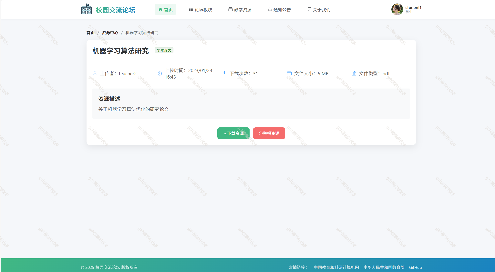

# springbootA528
springbootA528校园交流论坛系统
 
## 查看主页获取源码

### 一、关键词
校园论坛，校园论坛系统

### 二、作品包含
源码+数据库+全套环境和工具资源+本地部署教程

### 三、项目技术
前端技术：Vue3.0、Element Plus + Axios
后端技术：Java、SpringBoot3.0、MyBatis-Plus

### 四、运行环境（以下版本亲测，其他版本兼容性请自行测试）
开发工具：IDEA/eclipse  + VSCODE

数据库：MySQL8.0

数据库管理工具：Navicat10以上版本

环境配置软件： JDK17 + Maven3.6.3

前端Nodejs：18

浏览器：谷歌浏览器

### 五、项目介绍
项目编号：springbootA528

校园论坛是一个在线交流平台，旨在提供一个高效、便捷的师生互动环境。系统支持用户注册登录、发布帖子、回复评论、共享资源等基本功能，为师生之间的学术交流和日常互动提供便利。

系统包含以下三种角色：

1. 管理员：负责整个论坛的管理，包括版块管理和内容管理
2. 教师：教师用户，可以发布教学资源、参与讨论，可被任命为版主
3. 学生：学生用户，可以浏览资源、参与讨论，可被任命为版主

3. 功能模块划分

系统分为以下六大功能模块：

1. 用户管理模块：注册、登录、信息管理、个人资料维护（头像、个性签名、个人简介等）
2. 版区管理模块：版区创建、编辑、删除
3. 帖子管理模块：帖子发布、编辑、删除、查询
4. 评论管理模块：评论发布、删除、查询
5. 资源管理模块：资源上传、下载、分类管理
6. 系统管理模块：举报处理

3.1 功能模块详细划分

3.1.1 用户管理模块

1. 用户注册子模块
   - 用户注册表单
   - 用户信息验证
   - 验证码生成与校验
   - 用户信息存储

2. 用户登录子模块
   - 登录表单
   - 身份验证
   - JWT令牌生成
   - 登录状态管理

3. 个人信息管理子模块
   - 个人信息展示
   - 信息修改
   - 密码修改
   - 头像上传与裁剪
   - 个性签名与个人简介编辑

4. 用户列表管理子模块（仅管理员）
   - 用户信息查询
   - 用户状态管理（启用/禁用）
   - 用户角色分配（教师/学生）

3.1.2 版区管理模块

1. 版区创建子模块
2. 版区编辑子模块
3. 版主管理子模块
4. 版区内容概览子模块
3.1.3 帖子管理模块
1. 帖子发布子模块
2. 帖子编辑子模块
3. 帖子查询子模块
4. 帖子管理子模块
3.1.4 评论管理模块
1. 评论发布子模块
2. 评论展示子模块
3. 评论互动子模块
4. 评论管理子模块
3.1.5 资源管理模块

1. 资源上传子模块
2. 资源分类子模块
3. 资源搜索子模块
4. 资源下载子模块
3.1.6 系统管理模块
1. 举报处理子模块
3. 数据统计子模块

### 六、运行截图

